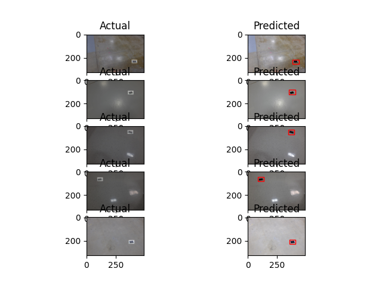
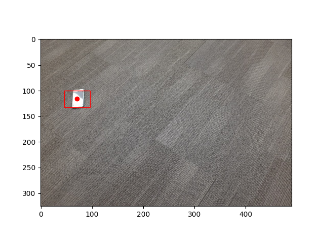

## Object Detection using Transfer Learning with R-CNN model
In this project I am tasked with identifying an object (in this case, a cellphone) in a given scene and compute the bouding box along with the center pixel coordinates as an output

Use the following instructions to build the code

### Dependencies 
- [Ubuntu 18.0x](https://releases.ubuntu.com/18.04/) - Operating System
- [Python 3.7.1](https://www.python.org/downloads/release/python-370/) - Programming Language Used
- [Tensorflow 1.15.3](https://www.tensorflow.org/) - Deep Learning and R-CNN Model
- [Keras 2.0.9](https://keras.io/) - Interface for Tensorflow library
- [h5py 2.10.0](https://www.h5py.org/)- Model Saving and Checkpoint Creation
- [Mask R-CNN model](https://github.com/matterport/Mask_RCNN) - Deep Learning Model for transfer learning

Please download the R-CNN model weights for COCO dataset into the current working directory from the following link:
https://github.com/matterport/Mask_RCNN/releases/download/v2.0/mask_rcnn_coco.h5

### Inside the Repo

The repository contains python scripts to train and test the model. It also contains the dataset on which the model was trained.

### Files
- find_phone.py : Python script to test the model.
- train_phone_finder.py : Python scrip to train the model.
- mask_rcnn_coco.h5 : Weights of the network trained for COCO dataset.
- readme.md

### Folders
- Mask_RCNN: Deep Learning Model used for Learning. Please Install the R-CNN model from the matterport/Mask_RCNN github repo
- dataset: Auto-generated folder with images and annotations
- find_phone: Dataset folder

### Training Script
- train_phone_finder.py : takes a single command line argument which is a path to the folder with labeled images and labels.txt
```
python3 train_phone_finder.py ~/find_phone
```

### Testing Script
- find_phone.py : takes a single command line argument which is a path to the jpeg image to be tested.

```
 python3 find_phone.py ~/60.jpg
```


### Output
Make sure the weights created by the training script is located in the above mentioned directory of the test image.
Below is the expected output of the testing script.
```
Phone in image 60.jpg is located at x-y coordinates given below.

0.1449 0.3558
```
A comparison of the predicted images and the actual images for object detection:



The centroid of the object along with the bounding box can be seen as:

